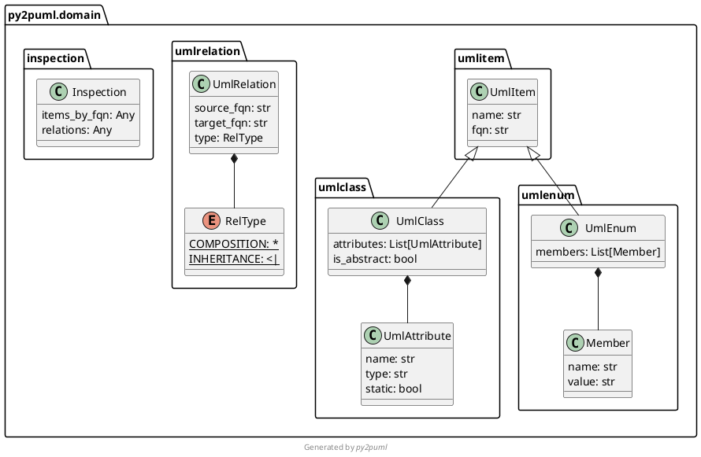
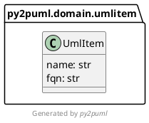

<div align="center">
  <a href="https://www.python.org/psf-landing/" target="_blank">
    
  </a>
  <a href="https://plantuml.com/" target="_blank">
    
  </a>
  <h1>Python to PlantUML</h1>
</div>

Generate PlantUML class diagrams to document your Python application.

[](https://results.pre-commit.ci/latest/github/lucsorel/py2puml/main)


`py2puml` uses [pre-commit hooks](https://pre-commit.com/) and [pre-commit.ci Continuous Integration](https://pre-commit.ci/) to enforce commit messages, code formatting and linting for quality and consistency sake.
See the [code conventions](#code-conventions) section if you would like to contribute to the project.

## Installation

`py2puml` is a command-line interface (CLI) documentation tool that can be installed as a dependency of your project, or installed globally on your system, or even run in an isolated way.

### Install as a project dependency

Install `py2puml` from [PyPI](https://pypi.org/project/py2puml/) with your favorite installation tool:

```sh
pip install py2puml

uv add py2puml

poetry add py2puml

pipenv install py2puml
```

### Run as an isolated binary

Uv can download and install py2puml on your system and run it in an isolated way (no influence on your other Python tools):

```sh
uvx --isolated py2puml --help
```

## Usage

The primary purpose of `py2puml` is to document domain models as [PlantUML class diagrams](https://plantuml.com/en/class-diagram), it focuses on data structures attributes and relationships (inheritance and composition/association).
Documenting methods may come later.

Once `py2puml` is installed, an eponymous CLI is available in your environment shell.

### Generate documentation in the standard output

Give `py2puml` a package (a folder) or a module (a `.py` file) to inspect and it will generate the PlantUML diagram either in the standard output or in a file path:

To document the domain model used by `py2puml` to model data structures:

```sh
# at the root of the py2puml project
py2puml --path py2puml/domain
# short-flag version:
py2puml -p py2puml/domain
```

This outputs the following PlantUML content:



Using PlantUML (online or with IDE extensions) renders this content as follows:


### Pipe the diagram in a local PlantUML server

Pipe the result of the CLI with a PlantUML server for instantaneous documentation (rendered by ImageMagick):

```sh
# runs a local PlantUML server from a docker container:
docker run -d --rm -p 1234:8080 --name plantumlserver plantuml/plantuml-server:jetty

py2puml -p py2puml/domain | curl -X POST --data-binary @- http://localhost:1234/svg/ --output - | display

# stop the container when you don't need it anymore, restart it later
docker stop plantumlserver
docker start plantumlserver
```

### Generate documentation in a file

```sh
py2puml --path py2puml/domain --output-file py2puml-domain.puml
# short-flag version:
py2puml -p py2puml/domain -o py2puml-domain.puml
```

### Generate documentation for a specific module

```sh
py2puml --path py2puml/domain/umlitem.py
```



### Generate documentation for a project with a src folder

Use the `--path` flag to indicate the path to the root namespace of the project and the `--namespace` flag to indicate that the "src" part should be ignored:

```sh
py2puml -p src/project -n project
```

Note: `py2puml` won't handle automatically the "src" part if it is in the middle of the path to inspect.

### Use py2puml outside the namespace root

By default, `py2puml` derives the Python namespace from the given path, assuming the command is called from the root namespace:

```sh
py2puml --path py2puml/domain
# is equivalent to:
py2puml --path py2puml/domain --namespace py2puml.domain
# short-flag version
py2puml -p py2puml/domain -n py2puml.domain
```

But sometimes your shell may be positionned out of the namespace folder, or within it.
In such cases, it is necessary to specify the namespace of the domain to inspect so that `py2puml` can inspect it properly and follow the imports in the inspected package or modules:

```sh
# from your home folder:
# - for a package
py2puml --path repositories/py2puml/py2puml/domain --namespace py2puml.domain
# -> py2puml will move down its "inspection working directory" to repositories/py2puml

# - for a module
py2puml -p repositories/py2puml/py2puml/domain/item.py -n py2puml.domain.umlitem

# from a sub-package of the project to inspect (in py2puml/domain)
# - for a package
py2puml --path . --namespace py2puml.domain
# -> py2puml will move its "inspection working directory" up 2 folders in order to be at the root namespace
# - for a module
py2puml -p umlitem.py -n py2puml.domain.umlitem
```

### Help commands

For a full overview of the CLI, run:

```sh
# documents the available flags and their description
py2puml --help

# displays the installed version
py2puml --version
# -> py2puml 0.11.0
```

### Python API

To programatically create the diagram of the `py2puml` domain classes, import the `py2puml` function in your script:

```python
from py2puml.py2puml import py2puml

if __name__ == '__main__':
    # 1. outputs the PlantUML content in the terminal
    print(''.join(py2puml('py2puml/domain', 'py2puml.domain')))

    # 2. or writes the PlantUML content in a file
    with open('py2puml/py2puml.domain.puml', 'w', encoding='utf8') as puml_file:
        puml_file.writelines(py2puml('py2puml/domain', 'py2puml.domain'))
```

## How it works

`py2puml` internally uses code [inspection](https://docs.python.org/3/library/inspect.html) (also called *reflexion* in other programming languages) and [abstract tree parsing](https://docs.python.org/3/library/ast.html) to retrieve relevant information.

### Features

From a given path corresponding to a folder containing Python code, `py2puml` inspects each Python module and generates a [PlantUML diagram](https://plantuml.com/en/class-diagram) from the definitions of various data structures using:

* **[inspection](https://docs.python.org/3/library/inspect.html)** and [type annotations](https://docs.python.org/3/library/typing.html) to detect:
  * static class attributes and [dataclass](https://docs.python.org/3/library/dataclasses.html) fields
  * fields of [namedtuples](https://docs.python.org/3/library/collections.html#collections.namedtuple)
  * members of [enumerations](https://docs.python.org/3/library/enum.html)
  * composition and inheritance relationships.
The detection of composition relationships relies on type annotations only, assigned values or expressions are never evaluated to prevent unwanted side-effects

* parsing **[abstract syntax trees](https://docs.python.org/3/library/ast.html#ast.NodeVisitor)** to detect the instance attributes defined in `__init__` constructors

`py2puml` outputs diagrams in PlantUML syntax, which can be:
* versioned along your code with a unit-test ensuring its consistency (see the [test_py2puml.py's test_assert_domain_documentation](tests/py2puml/test_py2puml.py) example).
You can also use the `assert_py2puml_command_args` utility from [py2puml.asserts](py2puml/asserts.py) to check the output of a `py2puml` command against a versioned file (that you can easily update):

```python
from py2puml.asserts import assert_py2puml_command_args

def test_assert_domain_documentation():
    assert_py2puml_command_args('-p py2puml/domain', DOCUMENTATION_PATH / 'py2puml.domain.puml')
    # temporarily add the `overwrite_expected_output=True` argument to update the file containing the expected contents
    assert_py2puml_command_args('-p py2puml/domain', DOCUMENTATION_PATH / 'py2puml.domain.puml', overwrite_expected_output=True)
```

* generated and hosted along other code documentation (better option: generated documentation should not be versioned with the codebase)

If you like tools related with PlantUML, you may also be interested in this [lucsorel/plantuml-file-loader](https://github.com/lucsorel/plantuml-file-loader) project:
a webpack loader which converts PlantUML files into images during the webpack processing (useful to [include PlantUML diagrams in your slides](https://github.com/lucsorel/markdown-image-loader/blob/master/README.md#web-based-slideshows) with RevealJS or RemarkJS).


## Changelog and versions

* `0.11.0`: new CLI API with `-p` and `-n` flags, support parsing a specific module, the `py2puml` CLI can be called outside of the project namespace, use `uv` tooling instead of `poetry`
* `0.10.0`: support ellipsis in type annotations (tuple with arbitrary length)
* `0.9.1`: improved 0.7.2 by adding the current working directory at the beginning of the sys.path to resolve the module paths of the project being inspected.
Fix url to PlantUML logo on the README.md page
* `0.9.0`: add classes defined in `__init__.py` files to plantuml output; replaced yapf by the ruff formatter
* `0.8.1`: delegated the grouping of nested namespaces (see `0.7.0`) to the PlantUML binary, which handles it natively
* `0.8.0`: added support for union types, and github actions (pre-commit hooks + automated tests)
* `0.7.2`: added the current working directory to the import path to make `py2puml` work in any directory or in native virtual environment (not handled by `poetry`)
* `0.7.1`: removed obsolete part of documentation: deeply compound types are now well handled (by version `0.7.0`)
* `0.7.0`: improved the generated PlantUML documentation (added the namespace structure of the code base, homogenized type  between inspection and parsing), improved relationships management (handle forward references, deduplicate relationships)
* `0.6.1`: handle class names with digits
* `0.6.0`: handle abstract classes
* `0.5.4`: fixed the packaging so that the contribution guide is included in the published package
* `0.5.3`: handle constructors decorated by wrapping decorators (decorators making uses of `functools.wrap`)
* `0.5.2`: specify in `pyproject.toml` that `py2puml` requires python 3.8+ (`ast.get_source_segment` was introduced in 3.8)
* `0.5.1`: prevent from parsing inherited constructors
* `0.5.0`: handle instance attributes in class constructors, add code coverage of unit tests
* `0.4.0`: add a simple CLI
* `0.3.1`: inspect sub-folders recursively
* `0.3.0`: handle classes derived from namedtuples (attribute types are `Any`)
* `0.2.0`: handle inheritance relationships and enums
* `0.1.3`: first release, handle all modules of a folder and compositions of domain classes

## Licence

Unless stated otherwise all works are licensed under the [MIT license](http://spdx.org/licenses/MIT.html), a copy of which is included [here](LICENSE).

## Contributions

I'm thankful to [all the people who have contributed](https://github.com/lucsorel/py2puml/graphs/contributors) to this project:


* [Luc Sorel-Giffo](https://github.com/lucsorel)
* [Doyou Jung](https://github.com/doyou89)
* [Julien Jerphanion](https://github.com/jjerphan)
* [Luis Fernando Villanueva Pérez](https://github.com/jonykalavera)
* [Konstantin Zangerle](https://github.com/justkiddingcode)
* [Mieszko](https://github.com/0xmzk)

### Pull requests and code conventions

Pull-requests are welcome and will be processed on a best-effort basis.

Pull requests must follow the guidelines enforced by `pre-commit` hooks (see the [.pre-commit-config.yaml](.pre-commit-config.yaml) configuration file):

- commit messages must follow the the conventional-commit rules enforced by the `commitlint` hook
- code formatting must follow the conventions enforced by the `isort` and `ruff-format` hooks
- code linting should not detect code smells in your contributions, this is checked by the `ruff-check` hook

Please also follow the [contributing guide](CONTRIBUTING.md) to ease your contribution.

### Pre-commit hooks

#### Activate the git hooks

Set the git hooks (`pre-commit` and `commit-msg` types):

```sh
uv run pre-commit install
```

#### Run the hooks locally

Before committing, you can check your changes with:

```sh
# all hooks on the staged files
uv run pre-commit run

# all hooks on all files
uv run pre-commit run --all-files

# a specific hook on all files
uv run pre-commit run ruff-format --all-files
```

#### Code formatting

This project uses `isort` and `ruff-format` to format the code.
The guidelines are expressed in their respective sections in the [pyproject.toml](pyproject.toml) file.

#### Static analysis and best practices

This project uses the `ruff-check` linter, which is configured in its section in the [pyproject.toml](pyproject.toml) file.

#### Commit messages

Please, follow the [conventional commit guidelines](https://www.conventionalcommits.org/en/v1.0.0/) for commit messages.
When merging your pull-request, the new version of the project will be derived from the commit messages.

### Tests

Add automated tests on your contributions, which can be run with the vollowing commands:

```sh
# directly with poetry
uv run pytest -v

# in a virtual environment
python3 -m pytest -v

# a specific test suite file or a given test
uv run pytest -v tests/py2puml/test_cli_controller.py
uv run pytest -v -k test_controller_stdout_and_in_file
```

Code coverage (with [missed branch statements](https://pytest-cov.readthedocs.io/en/latest/config.html?highlight=--cov-branch)):

```sh
uv run pytest -v --cov=src/py2puml --cov-branch --cov-report term-missing --cov-fail-under 93
```

## Current limitations

* regarding **inspection**

  * type hinting is optional when writing Python code and discarded when it is executed, as mentionned in the [typing official documentation](https://docs.python.org/3/library/typing.html).
  The quality of the diagram output by `py2puml` depends on the reliability of the type annotations

  > The `python` runtime does not enforce function and variable type annotations. They can be used by third party tools such as type checkers, IDEs, linters, etc.
  * inspection implies that the `python` interpreter parses your `.py` files, make sure that your executable code is guarded by `if __name__ == '__main__':` clauses so that it won't be executed during a `py2puml` inspection

* regarding the detection of instance attributes with **AST parsing**:
  * only constructors are visited, attributes assigned in other functions won't be documented
  * attribute types are inferred from type annotations:
    * of the attribute itself
    * of the variable assigned to the attribute: a signature parameter or a locale variable
    * to avoid side-effects, no code is executed nor interpreted

## Alternatives

If `py2puml` does not meet your needs (suggestions and pull-requests are **welcome**), you can have a look at these projects which follow other approaches (AST, linting, modeling):

* [pyreverse](https://pylint.pycqa.org/en/latest/additional_commands/index.html#pyreverse), which includes a PlantUML printer [since version 2.10.0](https://pylint.pycqa.org/en/latest/whatsnew/changelog.html?highlight=plantuml#what-s-new-in-pylint-2-10-0)
* [cb109/pyplantuml](https://github.com/cb109/pyplantuml)
* [deadbok/py-puml-tools](https://github.com/deadbok/py-puml-tools)
* [caballero/genUML](https://github.com/jose-caballero/genUML)
