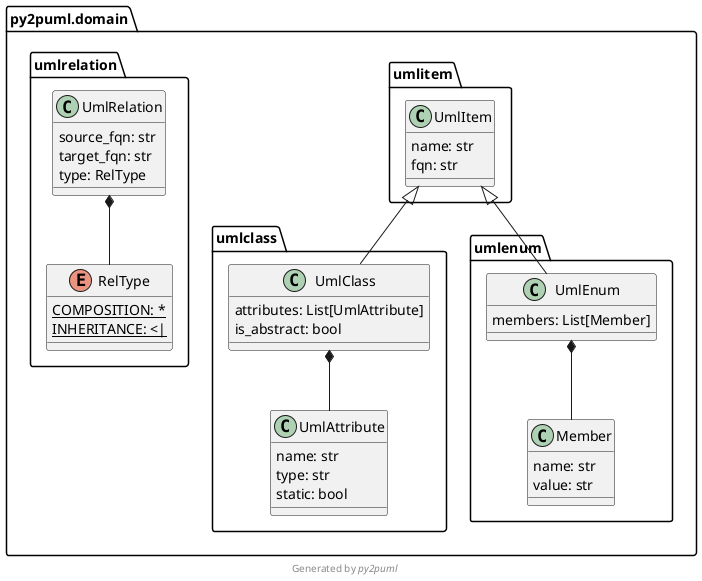

<div align="center">
  <a href="https://www.python.org/psf-landing/" target="_blank">
    
  </a>
  <a href="https://plantuml.com/" target="_blank">
    
  </a>
  <h1>Python to PlantUML</h1>
</div>

Generate PlantUML class diagrams to document your Python application.

[](https://results.pre-commit.ci/latest/github/lucsorel/py2puml/main)


`py2puml` uses [pre-commit hooks](https://pre-commit.com/) and [pre-commit.ci Continuous Integration](https://pre-commit.ci/) to enforce commit messages, code formatting and linting for quality and consistency sake.
See the [code conventions](#code-conventions) section if you would like to contribute to the project.


# How it works

`py2puml` produces a class diagram [PlantUML script](https://plantuml.com/en/class-diagram) representing classes properties (static and instance attributes) and their relations (composition and inheritance relationships).

`py2puml` internally uses code [inspection](https://docs.python.org/3/library/inspect.html) (also called *reflexion* in other programming languages) and [abstract tree parsing](https://docs.python.org/3/library/ast.html) to retrieve relevant information.

## Minimum Python versions to run py2puml

`p2puml` uses some code-parsing features that are available only since **Python 3.8** (like [ast.get_source_segment](https://docs.python.org/3/library/ast.html#ast.get_source_segment)).
If your codebase uses the `int | float` syntax to define optional types, then you should use Python 3.10 to run `py2puml`.

To sum it up, use at least Python 3.8 to run py2puml, or a higher version if you use syntax features available only in higher versions.

The [.python-version](.python-version) file indicates the Python version used to develop the library.
It is a file used by [pyenv](https://github.com/pyenv/pyenv/) to define the binary used by the project.

## Features

From a given path corresponding to a folder containing Python code, `py2puml` processes each Python module and generates a [PlantUML script](https://plantuml.com/en/class-diagram) from the definitions of various data structures using:

* **[inspection](https://docs.python.org/3/library/inspect.html)** and [type annotations](https://docs.python.org/3/library/typing.html) to detect:
  * static class attributes and [dataclass](https://docs.python.org/3/library/dataclasses.html) fields
  * fields of [namedtuples](https://docs.python.org/3/library/collections.html#collections.namedtuple)
  * members of [enumerations](https://docs.python.org/3/library/enum.html)
  * composition and inheritance relationships (between your domain classes only, for documentation sake).
The detection of composition relationships relies on type annotations only, assigned values or expressions are never evaluated to prevent unwanted side-effects

* parsing **[abstract syntax trees](https://docs.python.org/3/library/ast.html#ast.NodeVisitor)** to detect the instance attributes defined in `__init__` constructors

`py2puml` outputs diagrams in PlantUML syntax, which can be:
* versioned along your code with a unit-test ensuring its consistency (see the [test_py2puml.py's test_py2puml_model_on_py2uml_domain](tests/py2puml/test_py2puml.py) example)
* generated and hosted along other code documentation (better option: generated documentation should not be versioned with the codebase)

To generate image files, use the PlantUML runtime, a docker image of the runtime (see [think/plantuml](https://hub.docker.com/r/think/plantuml)) or of a server (see the CLI documentation below)

If you like tools related with PlantUML, you may also be interested in this [lucsorel/plantuml-file-loader](https://github.com/lucsorel/plantuml-file-loader) project:
a webpack loader which converts PlantUML files into images during the webpack processing (useful to [include PlantUML diagrams in your slides](https://github.com/lucsorel/markdown-image-loader/blob/master/README.md#web-based-slideshows) with RevealJS or RemarkJS).

# Install

Install from [PyPI](https://pypi.org/project/py2puml/):

* with `pip`:

```sh
pip install py2puml
```

* with [poetry](https://python-poetry.org/docs/):

```sh
poetry add py2puml
```

* with [pipenv](https://pipenv.readthedocs.io/en/latest/):

```sh
pipenv install py2puml
```

# Usage

## CLI

Once `py2puml` is installed at the system level, an eponymous command is available in your environment shell.

For example, to create the diagram of the classes used by `py2puml`, run:

```sh
py2puml py2puml/domain py2puml.domain
```

This outputs the following PlantUML content:



Using PlantUML, this content is rendered as in this diagram:


For a full overview of the CLI, run:

```sh
py2puml --help
```

The CLI can also be launched as a python module:

```sh
python -m py2puml py2puml/domain py2puml.domain
```

Pipe the result of the CLI with a PlantUML server for instantaneous documentation (rendered by ImageMagick):

```sh
# runs a local PlantUML server from a docker container:
docker run -d --rm -p 1234:8080 --name plantumlserver plantuml/plantuml-server:jetty

py2puml py2puml/domain py2puml.domain | curl -X POST --data-binary @- http://localhost:1234/svg/ --output - | display

# stops the container when you don't need it anymore, restarts it later
docker stop plantumlserver
docker start plantumlserver
```

## Python API

For example, to create the diagram of the domain classes used by `py2puml`:

* import the `py2puml` function in your script:

```python
from py2puml.py2puml import py2puml

if __name__ == '__main__':
    # outputs the PlantUML content in the terminal
    print(''.join(py2puml('py2puml/domain', 'py2puml.domain')))

    # writes the PlantUML content in a file
    with open('py2puml/py2puml.domain.puml', 'w', encoding='utf8') as puml_file:
        puml_file.writelines(py2puml('py2puml/domain', 'py2puml.domain'))
```

* running it outputs the previous PlantUML diagram in the terminal and writes it in a file.


# Tests

```sh
# directly with poetry
poetry run pytest -v

# in a virtual environment
python3 -m pytest -v
```

Code coverage (with [missed branch statements](https://pytest-cov.readthedocs.io/en/latest/config.html?highlight=--cov-branch)):

```sh
poetry run pytest -v --cov=py2puml --cov-branch --cov-report term-missing --cov-fail-under 93
```

# Changelog

* `0.9.1`: improved 0.7.2 by adding the current working directory at the beginning of the sys.path to resolve the module paths of the project being inspected.
Fix url to PlantUML logo on the README.md page
* `0.9.0`: add classes defined in `__init__.py` files to plantuml output; replaced yapf by the ruff formatter
* `0.8.1`: delegated the grouping of nested namespaces (see `0.7.0`) to the PlantUML binary, which handles it natively
* `0.8.0`: added support for union types, and github actions (pre-commit hooks + automated tests)
* `0.7.2`: added the current working directory to the import path to make py2puml work in any directory or in native virtual environment (not handled by poetry)
* `0.7.1`: removed obsolete part of documentation: deeply compound types are now well handled (by version `0.7.0`)
* `0.7.0`: improved the generated PlantUML documentation (added the namespace structure of the code base, homogenized type  between inspection and parsing), improved relationships management (handle forward references, deduplicate relationships)
* `0.6.1`: handle class names with digits
* `0.6.0`: handle abstract classes
* `0.5.4`: fixed the packaging so that the contribution guide is included in the published package
* `0.5.3`: handle constructors decorated by wrapping decorators (decorators making uses of `functools.wrap`)
* `0.5.2`: specify in pyproject.toml that py2puml requires python 3.8+ (`ast.get_source_segment` was introduced in 3.8)
* `0.5.1`: prevent from parsing inherited constructors
* `0.5.0`: handle instance attributes in class constructors, add code coverage of unit tests
* `0.4.0`: add a simple CLI
* `0.3.1`: inspect sub-folders recursively
* `0.3.0`: handle classes derived from namedtuples (attribute types are `Any`)
* `0.2.0`: handle inheritance relationships and enums
* `0.1.3`: first release, handle all modules of a folder and compositions of domain classes

# Licence

Unless stated otherwise all works are licensed under the [MIT license](http://spdx.org/licenses/MIT.html), a copy of which is included [here](LICENSE).

# Contributions

* [Luc Sorel-Giffo](https://github.com/lucsorel)
* [Doyou Jung](https://github.com/doyou89)
* [Julien Jerphanion](https://github.com/jjerphan)
* [Luis Fernando Villanueva Pérez](https://github.com/jonykalavera)
* [Konstantin Zangerle](https://github.com/justkiddingcode)

## Pull requests

Pull-requests are welcome and will be processed on a best-effort basis.

Pull requests must follow the guidelines enforced by the `pre-commit` hooks:

- commit messages must follow the Angular conventions enforced by the `commitlint` hook
- code formatting must follow the conventions enforced by the `isort` and `ruff-format` hooks
- code linting should not detect code smells in your contributions, this is checked by the `ruff` hook

Please also follow the [contributing guide](CONTRIBUTING.md) to ease your contribution.

## Code conventions

The code conventions are described and enforced by [pre-commit hooks](https://pre-commit.com/hooks.html) to maintain consistency across the code base.
The hooks are declared in the [.pre-commit-config.yaml](.pre-commit-config.yaml) file.

Set the git hooks (pre-commit and commit-msg types):

```sh
poetry run pre-commit install --hook-type pre-commit --hook-type commit-msg
```

Before committing, you can check your changes with:

```sh
# put all your changes in the git staging area
git add -A

# all hooks
poetry run pre-commit run --all-files

# a specific hook
poetry run pre-commit run ruff --all-files
```

### Commit messages

Please, follow the [conventions of the Angular team](https://github.com/angular/angular/blob/main/CONTRIBUTING.md#-commit-message-format) for commit messages.
When merging your pull-request, the new version of the project will be derived from the messages.

### Code formatting

This project uses `isort` and `ruff-format` to format the code.
The guidelines are expressed in their respective sections in the [pyproject.toml](pyproject.toml) file.

### Best practices

This project uses the `ruff` linter, which is configured in its section in the [pyproject.toml](pyproject.toml) file.

# Current limitations

* regarding **inspection**

  * type hinting is optional when writing Python code and discarded when it is executed, as mentionned in the [typing official documentation](https://docs.python.org/3/library/typing.html). The quality of the diagram output by `py2puml` depends on the reliability with which the type annotations were written

  > The Python runtime does not enforce function and variable type annotations. They can be used by third party tools such as type checkers, IDEs, linters, etc.

* regarding the detection of instance attributes with **AST parsing**:
  * only constructors are visited, attributes assigned in other functions won't be documented
  * attribute types are inferred from type annotations:
    * of the attribute itself
    * of the variable assigned to the attribute: a signature parameter or a locale variable
    * to avoid side-effects, no code is executed nor interpreted

# Alternatives

If `py2puml` does not meet your needs (suggestions and pull-requests are **welcome**), you can have a look at these projects which follow other approaches (AST, linting, modeling):

* [pyreverse](https://pylint.pycqa.org/en/latest/additional_commands/index.html#pyreverse), which includes a PlantUML printer [since version 2.10.0](https://pylint.pycqa.org/en/latest/whatsnew/changelog.html?highlight=plantuml#what-s-new-in-pylint-2-10-0)
* [cb109/pyplantuml](https://github.com/cb109/pyplantuml)
* [deadbok/py-puml-tools](https://github.com/deadbok/py-puml-tools)
* [caballero/genUML](https://github.com/jose-caballero/genUML)
