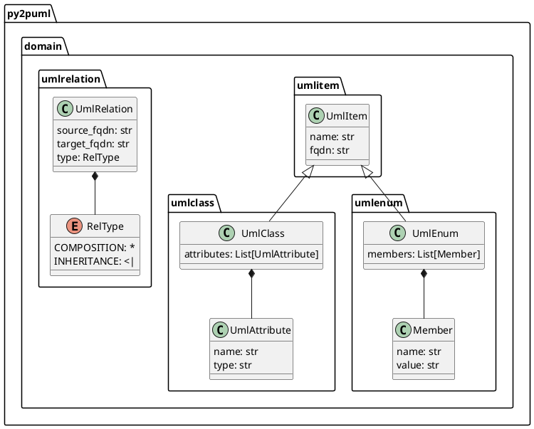

<div align="center">
  <a href="https://www.python.org/psf-landing/" target="_blank">
    
  </a>
  <a href="http://plantuml.com/" target="_blank">
    
  </a>
  <h1>Python to PlantUML</h1>
</div>

Generate Plantuml diagrams to document your python code

# How it works

## Features

From a given path corresponding to a folder containing python code, `py2puml` loads each file as a module and generate a class diagram with the [PlantUML](https://plantuml.com/en/class-diagram) using:

* inspection to detect the classes to document (see the [inspect](https://docs.python.org/3/library/inspect.html) module)
* annotations (the python type hinting syntax) to detect the attributes and their types (see the [typing](https://docs.python.org/3/library/typing.html) module)
* fields for classes derived from namedtuples
* composition and inheritance relationships are drawn only between the domain classes (this is designed on purpose, for documentation sake)

## Current limitations

* type hinting is optional when writing Python code and discarded when it is executed, as mentionned in the [typing official documentation](https://docs.python.org/3/library/typing.html). The quality of the diagram output by `py2puml` depends on the reliability with which the type annotations were written

> The Python runtime does not enforce function and variable type annotations. They can be used by third party tools such as type checkers, IDEs, linters, etc.

* complex type hints with more than one level of genericity are not properly handled for the moment: `List[MyClass]` or `Dict[str, MyClass]` are handled properly, `Dict[str, List[MyClass]]` is not. If your domain classes (also called business objects or DTOs) have attributes with complex type hints, it may be a code smell indicating that you should write a class which would better represent the business logic. But I may improve this part of the library as well 😀

* `py2puml` outputs diagrams in PlantUML syntax, which can be saved in text files along your python code and versioned with them. To generate image files, use the PlantUML runtime or a docker image (see [think/plantuml](https://hub.docker.com/r/think/plantuml))

* `py2puml` uses features of python 3 (generators for example) and thus won't work with python 2 runtimes. It relies on native python modules and uses no 3rd-party library, except [pytest](https://docs.pytest.org/en/latest/) as a development dependency for running the unit-tests

If you like tools around PlantUML, you may also be interested in this [lucsorel/plantuml-file-loader](https://github.com/lucsorel/plantuml-file-loader) project: A webpack loader which converts PlantUML files into images during the webpack processing (useful to [include PlantUML diagrams in your slides](https://github.com/lucsorel/markdown-image-loader/blob/master/README.md#web-based-slideshows) with RevealJS or RemarkJS).

# Install

Install from PyPI:

* with `pip`:

```sh
pip install py2puml
```

* with [poetry](https://pipenv.readthedocs.io/en/latest/):

```sh
poetry add py2puml
```

* with [pipenv](https://pipenv.readthedocs.io/en/latest/):

```sh
pipenv install py2puml
```

# Usage

## CLI

Once `py2puml` is installed at the system level, an eponymous command is available in your environment shell.

For example, to create the diagram of the classes used by `py2puml`, one can use:
```sh
py2puml py2puml/domain py2puml.domain
```

This will output the following PlantUML script:



Using PlantUML, this script renders this diagram:


For a full overview of the CLI, run:

```sh
py2puml --help
```

The CLI can also be launched as a python module:

```sh
python -m py2puml py2puml/domain py2puml.domain
```

Pipe the result of the CLI with a PlantUML server for instantaneous documentation (rendered by ImageMagick):

```sh
# runs a local PlantUML server from a docker container:
docker run -d -p 1234:8080 --name plantumlserver plantuml/plantuml-server:jetty 

py2puml py2puml/domain py2puml.domain | curl -X POST --data-binary @- http://localhost:1234/svg/ --output - | display

# stops the container when you don't need it anymore, restarts it later, removes it
docker stop plantumlserver
docker start plantumlserver
docker rm plantumlserver
```

## Python API

For example, to create the diagram of the classes used by `py2puml`:

* import the py2puml function in your script (see [py2puml/example.py](py2puml/example.py)):

```python
from py2puml.py2puml import py2puml

# outputs the PlantUML content in the terminal
print(''.join(py2puml('py2puml/domain', 'py2puml.domain')))

# writes the PlantUML content in a file
with open('py2puml/domain.puml', 'w') as puml_file:
    puml_file.writelines(py2puml('py2puml/domain', 'py2puml.domain'))
```
* running it (`python3 -m py2puml.example`) will output the previous PlantUML diagram in the terminal and write it in a file.


# Tests

```sh
# directly with poetry
poetry run python -m pytest -v

# in a virtual environment
python3 -m pytest -v
```

# Changelog

* `0.4.0`: add a simple CLI
* `0.3.1`: inspect sub-folders recursively
* `0.3.0`: handle classes derived from namedtuples (attribute types are `any`)
* `0.2.0`: handle inheritance relationships and enums. Unit tested
* `0.1.3`: first release, handle all module of a folder and compositions of domain classes

# Licence

Unless stated otherwise all works are licensed under the [MIT license](http://spdx.org/licenses/MIT.html), a copy of which is included [here](LICENSE).

# Contributions

* [Luc Sorel-Giffo](https://github.com/lucsorel)
* [Doyou Jung](https://github.com/doyou89)
* [Julien Jerphanion](https://github.com/jjerphan)

Pull-requests are welcome and will be processed on a best-effort basis.


# Alternatives

If `py2puml` does not meet your needs (suggestions and pull-requests are **welcome**), you can have a look at these projects which follow other approaches (AST, linting, modeling):

* [cb109/pyplantuml](https://github.com/cb109/pyplantuml)
* [deadbok/py-puml-tools](https://github.com/deadbok/py-puml-tools)
* [caballero/genUML](https://github.com/jose-caballero/genUML)
