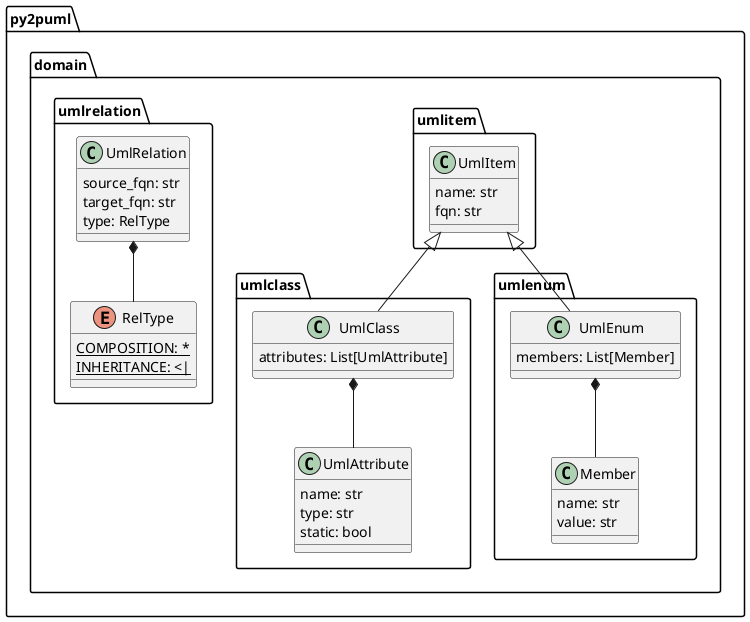

<div align="center">
  <a href="https://www.python.org/psf-landing/" target="_blank">
    
  </a>
  <a href="http://plantuml.com/" target="_blank">
    
  </a>
  <h1>Python to PlantUML</h1>
</div>

Generate PlantUML class diagrams to document your Python application.

# How it works

`py2puml` produces a class diagram [PlantUML script](https://plantuml.com/en/class-diagram) representing classes properties (static and instance attributes) and their relations (composition and inheritance relationships).

`py2puml` internally uses code [inspection](https://docs.python.org/3/library/inspect.html) (also called *reflexion* in other programming languages) and [abstract tree parsing](https://docs.python.org/3/library/ast.html) to retrieve relevant information.
Some parsing features are available only since Python 3.8 (like [ast.get_source_segment](https://docs.python.org/3/library/ast.html#ast.get_source_segment)).

## Features

From a given path corresponding to a folder containing Python code, `py2puml` processes each file as a module and generates a [PlantUML script](https://plantuml.com/en/class-diagram) of its classe-like definitions using:

* **[inspection](https://docs.python.org/3/library/inspect.html)** and [type annotations](https://docs.python.org/3/library/typing.html) to detect:
  * static class attributes and [dataclass](https://docs.python.org/3/library/dataclasses.html) fields
  * fields of [namedtuples](https://docs.python.org/3/library/collections.html#collections.namedtuple)
  * members of [enumerations](https://docs.python.org/3/library/enum.html)
  * composition and inheritance relationships (between your domain classes only, for documentation sake)

* parsing [abstract syntax trees](https://docs.python.org/3/library/ast.html#ast.NodeVisitor) to detect the instance attributes defined in `__init__` constructors

`py2puml` outputs diagrams in PlantUML syntax, which can be:
* versioned along your code with a unit-test ensuring its consistency (see the [test_py2puml.py's test_py2puml_model_on_py2uml_domain](tests/py2puml/test_py2puml.py) example)
* generated and hosted along other code documentation (better option: generated documentation should not be versioned with the codebase)

To generate image files, use the PlantUML runtime, a docker image of the runtime (see [think/plantuml](https://hub.docker.com/r/think/plantuml)) or of a server (see the CLI documentation below)

If you like tools related with PlantUML, you may also be interested in this [lucsorel/plantuml-file-loader](https://github.com/lucsorel/plantuml-file-loader) project:
a webpack loader which converts PlantUML files into images during the webpack processing (useful to [include PlantUML diagrams in your slides](https://github.com/lucsorel/markdown-image-loader/blob/master/README.md#web-based-slideshows) with RevealJS or RemarkJS).

# Install

Install from [PyPI](https://pypi.org/project/py2puml/):

* with `pip`:

```sh
pip install py2puml
```

* with [poetry](https://python-poetry.org/docs/):

```sh
poetry add py2puml
```

* with [pipenv](https://pipenv.readthedocs.io/en/latest/):

```sh
pipenv install py2puml
```

# Usage

## CLI

Once `py2puml` is installed at the system level, an eponymous command is available in your environment shell.

For example, to create the diagram of the classes used by `py2puml`, run:

```sh
py2puml py2puml/domain py2puml.domain
```

This outputs the following PlantUML script:



Using PlantUML, this script renders this diagram:


For a full overview of the CLI, run:

```sh
py2puml --help
```

The CLI can also be launched as a python module:

```sh
python -m py2puml py2puml/domain py2puml.domain
```

Pipe the result of the CLI with a PlantUML server for instantaneous documentation (rendered by ImageMagick):

```sh
# runs a local PlantUML server from a docker container:
docker run -d --rm -p 1234:8080 --name plantumlserver plantuml/plantuml-server:jetty 

py2puml py2puml/domain py2puml.domain | curl -X POST --data-binary @- http://localhost:1234/svg/ --output - | display

# stops the container when you don't need it anymore, restarts it later
docker stop plantumlserver
docker start plantumlserver
```

## Python API

For example, to create the diagram of the classes used by `py2puml`:

* import the py2puml function in your script (see [py2puml/example.py](py2puml/example.py)):

```python
from py2puml.py2puml import py2puml

# outputs the PlantUML content in the terminal
print(''.join(py2puml('py2puml/domain', 'py2puml.domain')))

# writes the PlantUML content in a file
with open('py2puml/domain.puml', 'w') as puml_file:
    puml_file.writelines(py2puml('py2puml/domain', 'py2puml.domain'))
```

* running it (`python3 -m py2puml.example`) will output the previous PlantUML diagram in the terminal and write it in a file.


# Tests

```sh
# directly with poetry
poetry run python -m pytest -v

# in a virtual environment
python3 -m pytest -v
```

Code coverage (with missed [branch statements](https://pytest-cov.readthedocs.io/en/latest/config.html?highlight=--cov-branch)):

```sh
poetry run python -m pytest -v --cov=py2puml --cov-branch --cov-report term-missing --cov-fail-under 90
```

# Changelog

* `0.5.2`: specify in pyproject.toml that py2puml requires python 3.8+ (`ast.get_source_segment` was introduced in 3.8)
* `0.5.1`: prevent from parsing inherited constructors
* `0.5.0`: handle instance attributes in class constructors, add code coverage of unit tests
* `0.4.0`: add a simple CLI
* `0.3.1`: inspect sub-folders recursively
* `0.3.0`: handle classes derived from namedtuples (attribute types are `Any`)
* `0.2.0`: handle inheritance relationships and enums
* `0.1.3`: first release, handle all modules of a folder and compositions of domain classes

# Licence

Unless stated otherwise all works are licensed under the [MIT license](http://spdx.org/licenses/MIT.html), a copy of which is included [here](LICENSE).

# Contributions

* [Luc Sorel-Giffo](https://github.com/lucsorel)
* [Doyou Jung](https://github.com/doyou89)
* [Julien Jerphanion](https://github.com/jjerphan)

Pull-requests are welcome and will be processed on a best-effort basis.

# Current limitations

* regarding **inspection**

  * type hinting is optional when writing Python code and discarded when it is executed, as mentionned in the [typing official documentation](https://docs.python.org/3/library/typing.html). The quality of the diagram output by `py2puml` depends on the reliability with which the type annotations were written

  > The Python runtime does not enforce function and variable type annotations. They can be used by third party tools such as type checkers, IDEs, linters, etc.

  * complex type hints with more than one level of genericity are not properly handled for the moment: `List[MyClass]` or `Dict[str, MyClass]` are handled properly, `Dict[str, List[MyClass]]` is not.
  If your domain classes (also called business objects or DTOs) have attributes with complex type hints, it may be a code smell indicating that you should write a class which would better represent the business logic.
  But I may improve this part of the library as well 😀

* regarding the detection of instance attributes with **AST parsing**:
  * only constructors are visited, attributes assigned in other functions won't be documented
  * attribute types are inferred from type annotations:
    * of the attribute itself
    * of the variable assigned to the attribute: a signature parameter or a locale variable
    * to avoid side-effects, no code is executed nor interpreted

# Alternatives

If `py2puml` does not meet your needs (suggestions and pull-requests are **welcome**), you can have a look at these projects which follow other approaches (AST, linting, modeling):

* [cb109/pyplantuml](https://github.com/cb109/pyplantuml)
* [deadbok/py-puml-tools](https://github.com/deadbok/py-puml-tools)
* [caballero/genUML](https://github.com/jose-caballero/genUML)
